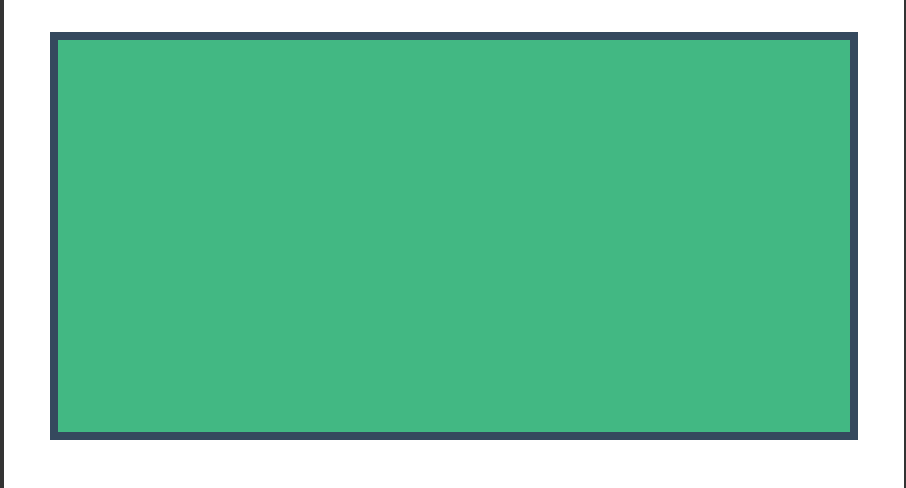
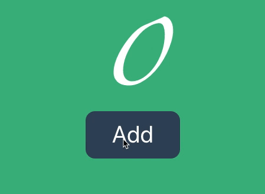
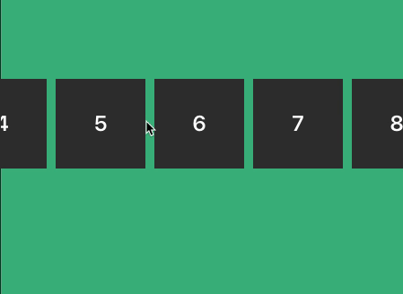

# vuvas

使用 vue 3.0 + css 在 canvas 上绘制高性能 UI

## 原理

Vue 3.0 中 将 dom 的渲染器单独抽离为了 [@vue/runtime-dom](https://github.com/vuejs/vue-next/tree/master/packages/runtime-dom)，[@vue/runtime-dom](https://github.com/vuejs/vue-next/tree/master/packages/runtime-dom) 可以看作是基于 [@vue/runtime-core](https://github.com/vuejs/vue-next/tree/master/packages/runtime-core) 提供的 API 构建的 web DOM 渲染器，[@vue/runtime-core](https://github.com/vuejs/vue-next/tree/master/packages/runtime-core) 可以看作是与环境无关的 vue 核心实现，Vuvas 真是基于此来构建的 Canvas 环境下的渲染器。Vuvas 底层布局基于 [yoga-layout](https://github.com/facebook/yoga)，因此可以很方便的使用 css flexbox 来布局我们的页面。

## 快速开始

安装

```bash
npm i vuvas -S
```

使用

> index.ts

```js
import { createApp } from 'vuvas'
import App from './index.vue'

createApp(App).mount(document.querySelector('#app'))
```

> index.vue

```html
<template>
  <View :style="styles.view">
      <Text :style="styles.text">{{text}}</Text>
  </View>
</template>

<script>
import { ref } from "vue";

export default {
  data() {
    return {
      text: 'vuvas',
      styles: {
        view: {
          height: 55,
          backgroundColor: "#D8D8D8",
        },
        text: {
          fontSize: 12,
          color: "#000",
        },
      },
    }
  }
};
</script>
```

## 组件

Vuvas 内置了帮助我们构建 UI 的基础组件，可以把这些组件视作 Vuvas 环境下的标准组件（类似于 web 环境下的 div、p等标签）。

### View

基础的布局组件，类似于 dom 中的 div、section 标签，例子：

代码：

> 在 [code sandbox](https://codesandbox.io/s/view-component-qfo7j) 中打开

```html
<template>
  <View :style="styles.container">
    <View :style="styles.content"></View>
  </View>
</template>
<script>
export default {
  setup() {
    return {
      styles: {
        container: {
          backgroundColor: '#fff',
          justifyContent: 'center',
          flex: 1,
          alignItems: 'center'
        },
        content: {
          height: 200,
          width: 400,
          backgroundColor: '#41b883',
          borderWidth: 4,
          borderColor: '#35495e'
        }
      },
    };
  },
};
</script>
```

效果：



### Text

文本标签，可以在标签内部添加文字，类似 dom 中的 p 标签，例子：

代码：

> 在 [code sandbox](https://codesandbox.io/s/text-component-wcs6d) 中打开

```html
<template>
  <View :style="styles.container">
    <Text :style="styles.text">Vuvas</Text>
  </View>
</template>
<script>
export default {
  setup() {
    return {
      styles: {
        container: {
          justifyContent: 'center',
          flex: 1,
          backgroundColor: '#41b883',
        },
        text: {
          fontSize: 100,
          fontWeight: 800,
          color: '#fff',
          height: 100,
          fontFamily: 'zapfino',
          textAlign: 'center'
        }
      },
    };
  },
};
</script>
```

效果：


### Image

基本的图像标签，通过 src 属性链接图片地址，使用这个可以显示图片，类似 dom 的 img 标签，例子：

代码：

> 在 [code sandbox](https://codesandbox.io/s/image-component-dl41z) 中打开

```html
<template>
  <View :style="styles.container">
    <Image src="./src/vue.png" :style="styles.image" />
  </View>
</template>
<script>
export default {
  setup() {
    return {
      styles: {
        container: {
          justifyContent: 'center',
          flex: 1,
          backgroundColor: '#fff',
          alignItems: 'center'
        },
        image: {
          height: 200,
          width: 200,
        }
      },
    };
  },
};
</script>
```

效果：


### Touchable

可触发 touch 事件的组件，使用这个组件可以添加 touchStart、touchMove、touchEnd、touchCancel 事件，例如实现一个 Button：

代码：

> 在 [code sandbox](https://codesandbox.io/s/touchable-component-mz140) 中打开

```html
<template>
  <View :style="styles.container">
    <View>
      <Text :style="styles.text">{{ count }}</Text>
      <Touchable :onPress="inc">
        <View :style="styles.content">
          <Text :style="styles.button">Add</Text>
        </View>
      </Touchable>
    </View>
  </View>
</template>
<script>
import { ref } from "vue";
export default {
  setup() {
    const count = ref(0);
    const inc = () => {
      count.value++;
    };
    return {
      count,
      inc,
      styles: {
        container: {
          justifyContent: "center",
          flex: 1,
          backgroundColor: "#41b883",
          alignItems: "center",
        },
        text: {
          fontSize: 100,
          fontWeight: 800,
          color: "#fff",
          height: 100,
          fontFamily: "zapfino",
          textAlign: "center",
        },
        content: {
          backgroundColor: "#36495d",
          height: 80,
          width: 160,
          justifyContent: "center",
          alignItems: "center",
          borderRadius: 16
        },
        button: {
          color: '#fff',
          fontSize: 40,
          height: 80,
          width: 200,
          textAlign: 'center',
        },
      },
    };
  },
};
</script>
```

效果：



### ScrollView

可滚动的组件，通过这个组件可以包裹其他组件来实现滚动效果：

代码：

> 在 [code sandbox](https://codesandbox.io/s/scrollview-component-do7kp) 中打开

```html
<template>
  <View :style="styles.container">
    <ScrollView horizontal :style="styles.scroll">
      <View
        :style="styles.box"
        v-for="(num, index) in numbers"
        :key="index"
      >
        <Text :style="styles.text">{{index + 1}}</Text>
      </View>
    </ScrollView>
  </View>
</template>
<script>
const numbers = [];
for (let i = 0; i < 20; i++) {
  numbers.push(i);
}
export default {
  setup() {
    return {
      numbers,
      styles: {
        container: {
          justifyContent: "center",
          flex: 1,
          backgroundColor: "#41b883",
        },
        scroll: {
          height: 55,
        },
        box: {
          width: 100,
          height: 100,
          justifyContent: "center",
          backgroundColor: "#333",
          marginRight: 10,
        },
        text: {
          color: "#fff",
          fontWeight: "600",
          fontSize: 24,
          textAlign: "center",
        },
      },
    };
  },
};
</script>
```

效果：



