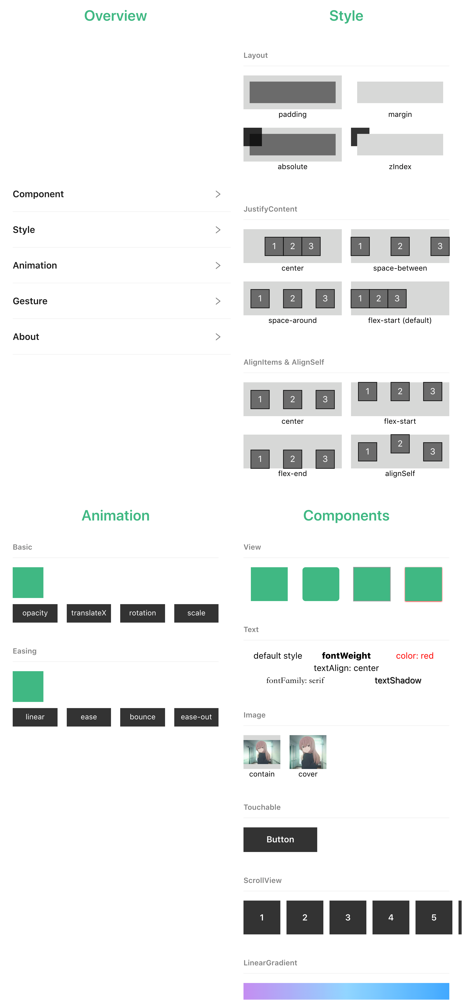
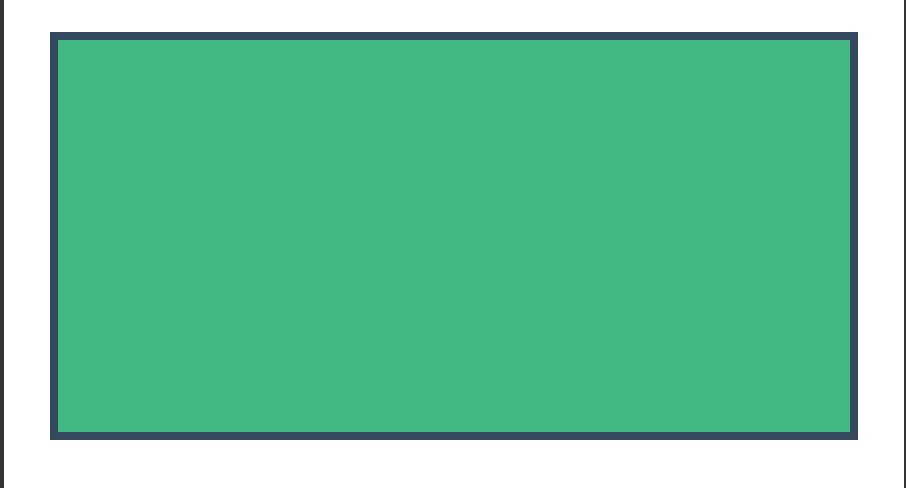
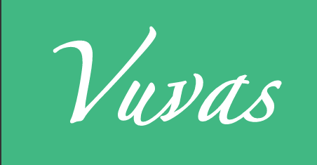
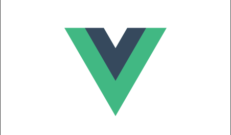
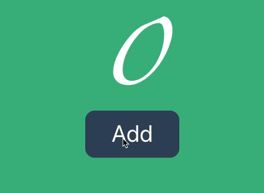
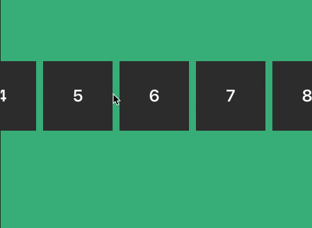

English | [中文](./README.md)

<h2 align="center">Use vue 3.0 + css to draw high-performance UI on canvas</h2>


- [Example](#example)
- [Principle](#principle)
- [Get Started](#get-started)
- [Components](#components)
  - [View](#view)
  - [Text](#text)
  - [Image](#image)
  - [Touchable](#touchable)
  - [ScrollView](#scrollview)
- [Thanks](#thanks)

## Example
<p style="text-align:center">
  
</p>

run the example:
```bash
npm run dev:demo
```

more examples：[https://codesandbox.io/u/huruji/sandboxes](https://codesandbox.io/u/huruji/sandboxes)


## Principle

In Vue 3.0, the renderer of dom was separated into [@vue/runtime-dom](https://github.com/vuejs/vue-next/tree/master/packages/runtime-dom), [@vue/ runtime-dom](https://github.com/vuejs/vue-next/tree/master/packages/runtime-dom) can be regarded as based on [@vue/runtime-core](https://github.com /vuejs/vue-next/tree/master/packages/runtime-core) web DOM renderer built by the API provided, [@vue/runtime-core](https://github.com/vuejs/vue-next/ tree/master/packages/runtime-core) can be regarded as a core implementation of Vue that has nothing to do with the environment. Vuvas is really a renderer based on this in the Canvas environment. The underlying layout of Vuvas is based on [yoga-layout](https://github.com/facebook/yoga), so we can easily use css flexbox to layout our pages.

## Get Started

installation

```bash
npm i vuvas -S
```

use

> index.ts

```js
import { createApp } from 'vuvas'
import App from './index.vue'

createApp(App).mount(document.querySelector('#app'))
```

> index.vue

```html
<template>
  <View :style="styles.view">
      <Text :style="styles.text">{{text}}</Text>
  </View>
</template>

<script>
import { ref } from "vue";

export default {
  data() {
    return {
      text: 'vuvas',
      styles: {
        view: {
          height: 55,
          backgroundColor: "#D8D8D8",
        },
        text: {
          fontSize: 12,
          color: "#000",
        },
      },
    }
  }
};
</script>
```

## Components

Vuvas has built-in basic components that help us build UI. These components can be regarded as standard components in the Vuvas environment (similar to tags such as div and p in the web environment).

### View

Basic layout components, similar to the div and section tags in dom, for example:

code：

> Open in [code sandbox](https://codesandbox.io/s/view-component-qfo7j)

```html
<template>
  <View :style="styles.container">
    <View :style="styles.content"></View>
  </View>
</template>
<script>
export default {
  setup() {
    return {
      styles: {
        container: {
          backgroundColor: '#fff',
          justifyContent: 'center',
          flex: 1,
          alignItems: 'center'
        },
        content: {
          height: 200,
          width: 400,
          backgroundColor: '#41b883',
          borderWidth: 4,
          borderColor: '#35495e'
        }
      },
    };
  },
};
</script>
```

Result：



### Text

Text tag, you can add text inside the tag, similar to the p tag in dom, example:

code：

> Open in [code sandbox](https://codesandbox.io/s/text-component-wcs6d)

```html
<template>
  <View :style="styles.container">
    <Text :style="styles.text">Vuvas</Text>
  </View>
</template>
<script>
export default {
  setup() {
    return {
      styles: {
        container: {
          justifyContent: 'center',
          flex: 1,
          backgroundColor: '#41b883',
        },
        text: {
          fontSize: 100,
          fontWeight: 800,
          color: '#fff',
          height: 100,
          fontFamily: 'zapfino',
          textAlign: 'center'
        }
      },
    };
  },
};
</script>
```

Result：



### Image

The basic image tag, link the image address through the src attribute, use this to display the image, similar to the img tag of dom, for example:

code：

> Open in [code sandbox](https://codesandbox.io/s/image-component-dl41z)

```html
<template>
  <View :style="styles.container">
    <Image src="./src/vue.png" :style="styles.image" />
  </View>
</template>
<script>
export default {
  setup() {
    return {
      styles: {
        container: {
          justifyContent: 'center',
          flex: 1,
          backgroundColor: '#fff',
          alignItems: 'center'
        },
        image: {
          height: 200,
          width: 200,
        }
      },
    };
  },
};
</script>
```

Result：



### Touchable

A component that can trigger touch events. Use this component to add touchStart, touchMove, touchEnd, and touchCancel events, such as implementing a Button:

Code：

> Open in [code sandbox](https://codesandbox.io/s/touchable-component-mz140)

```html
<template>
  <View :style="styles.container">
    <View>
      <Text :style="styles.text">{{ count }}</Text>
      <Touchable :onPress="inc">
        <View :style="styles.content">
          <Text :style="styles.button">Add</Text>
        </View>
      </Touchable>
    </View>
  </View>
</template>
<script>
import { ref } from "vue";
export default {
  setup() {
    const count = ref(0);
    const inc = () => {
      count.value++;
    };
    return {
      count,
      inc,
      styles: {
        container: {
          justifyContent: "center",
          flex: 1,
          backgroundColor: "#41b883",
          alignItems: "center",
        },
        text: {
          fontSize: 100,
          fontWeight: 800,
          color: "#fff",
          height: 100,
          fontFamily: "zapfino",
          textAlign: "center",
        },
        content: {
          backgroundColor: "#36495d",
          height: 80,
          width: 160,
          justifyContent: "center",
          alignItems: "center",
          borderRadius: 16
        },
        button: {
          color: '#fff',
          fontSize: 40,
          height: 80,
          width: 200,
          textAlign: 'center',
        },
      },
    };
  },
};
</script>
```

Result：



### ScrollView

Scrollable components, through which other components can be wrapped to achieve the scrolling effect:

Code：

> Open in [code sandbox](https://codesandbox.io/s/scrollview-component-do7kp)

```html
<template>
  <View :style="styles.container">
    <ScrollView horizontal :style="styles.scroll">
      <View
        :style="styles.box"
        v-for="(num, index) in numbers"
        :key="index"
      >
        <Text :style="styles.text">{{index + 1}}</Text>
      </View>
    </ScrollView>
  </View>
</template>
<script>
const numbers = [];
for (let i = 0; i < 20; i++) {
  numbers.push(i);
}
export default {
  setup() {
    return {
      numbers,
      styles: {
        container: {
          justifyContent: "center",
          flex: 1,
          backgroundColor: "#41b883",
        },
        scroll: {
          height: 55,
        },
        box: {
          width: 100,
          height: 100,
          justifyContent: "center",
          backgroundColor: "#333",
          marginRight: 10,
        },
        text: {
          color: "#fff",
          fontWeight: "600",
          fontSize: 24,
          textAlign: "center",
        },
      },
    };
  },
};
</script>
```

Result：



## Thanks

vuvas is the vue implementation version of [revas](https://github.com/pinqy520/revas), thanks [@pinqy520](https://github.com/pinqy520) 🙏🙏🙏